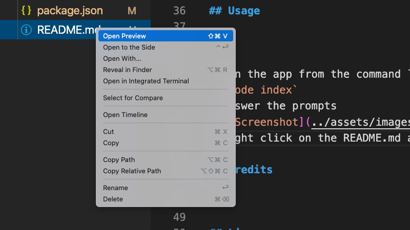

Professional README Generator
==========

## Description
-----------------
Your GitHub profile is an extremely important aspect of your public identity as a developer. A well-crafted one allows you to show off your work to other developers as well as potential employers. An important component of your GitHub profile—and one that many new developers often overlook—is the README.md file. The quality of a README often differentiates a good project from a bad project. A good one takes advantage of the opportunity to explain and showcase what your application does, justify the technologies used, and even talk about some of the challenges you faced and features you hope to implement in the future. A good README helps you stand out among the large crowd of developers putting their work on GitHub.   There's no one right way to structure a good README. There is one very wrong way, however, and that is to not include a README at all or to create a very anemic one.

## Table of Contents
-----------------
* [Installation](#installation)
* [Usage](#usage)
* [Credits](#credits)
* [License](#license)
* [Contributing](#contributing)
* [Tests](#tests)
* [Questions](#questions)

## Installation
-----------------
To run this application, you'll need Git and Node.js installed on your computer. From the command line:  Clone this repository: `git clone git@github.com:flokamp/readme-generator.git` Go to the root directory and install dependencies: `npm install`

## Usage
-----------------
Run the app from the command line: `node index`  Answer the prompts  Right click on the README.md and click "Open Preview" to see your generated README 

## Credits
-----------------
UT Austin Coding Bootcamp ([https://github.com/coding-boot-camp/potential-enigma](https://github.com/coding-boot-camp/potential-enigma)) provided the starter code for this project.

## License
-----------------
MIT License

## Contributing
-----------------
Feel free to send pull requests and raise issues.

## Tests
-----------------

## Questions
-----------------
My GitHub: [flokamp](https://github.com/flokamp)

If you have additional questions, email me! kampflo2@gmail.com
